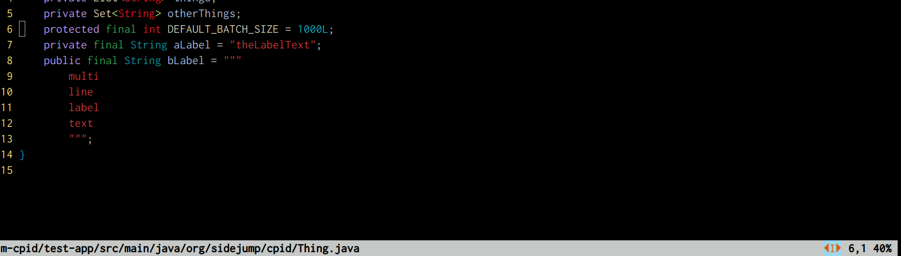
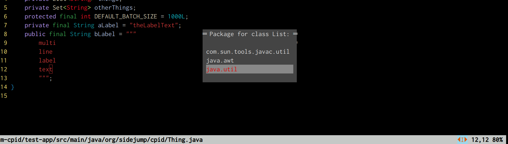

= `vim-cpid`

This is a vim plugin that aims to provide a few IDE-like niceties within a conventional vim experience. The primary focus is removing the tedium of java's import requirements. The plugin does the work of identifying the types used in a source file and the types imported into a source file. It relies on https://github.com/dvogel/cpid[cpid] to index java types and provide fast lookup for type names.

A few commands provided:

* `CheckForMissingImports` - Identifies the type names that have been used but not imported.
* `ReindexClasspath` - Uses Maven to generate a classpath and then asks cpid to index it.
* `ReindexProject` - Crawls the current directory recursively for `.java` files and indexes the type names and package names found therein.
* `FixMissingImports` - Provides a menu to select the package from which each missing import should be satifies.

A couple debugging commands:

* `CpidReconnect` - Primarily for recovering if you ever after to restart cpid.
* `CpidDebugOn` / `CpidDebugOff` - In case you want to help debug the plugin.

The plugin does not perform any checks automatically. You need to configure it to do so. This is how I do it, using my `ftplugin/java.vim` configuration file:

```
import "javacp.vim"

augroup CpidJavaTemp
	autocmd!
	autocmd BufRead *.java :call javacp.InitializeJavaBuffer()
	autocmd BufWrite *.java CheckForMissingImports
    autocmd InsertLeave *.java :call javacp.UpdateBufferShadow()
    autocmd TextChanged *.java :call javacp.UpdateBufferShadow()
    autocmd QuickFixCmdPost *.java :call javacp.UpdateBufferShadow()
augroup END
```

This causes the buffer to be checked for missing imports each time I save the file. I also setup a custom statusline to show an icon when there are missing imports:

```
function! JavaStatusLineExpr()
    return s:javacp.StatusLineExpr()
endfunction

setlocal statusline=%-f%=%%l,%c\ %p%%\ 
highlight CpidStatus guifg=drew_orange  guibg=drew_skyblue
```



Running the `:FixMissingImports` command then prompts me like so:




== Prerequisites

* The plugin currently assumes you're using maven.
* In order to propertly extract the JDK version from your `pom.xml` file you need to have `xmlstarlet` installed.

